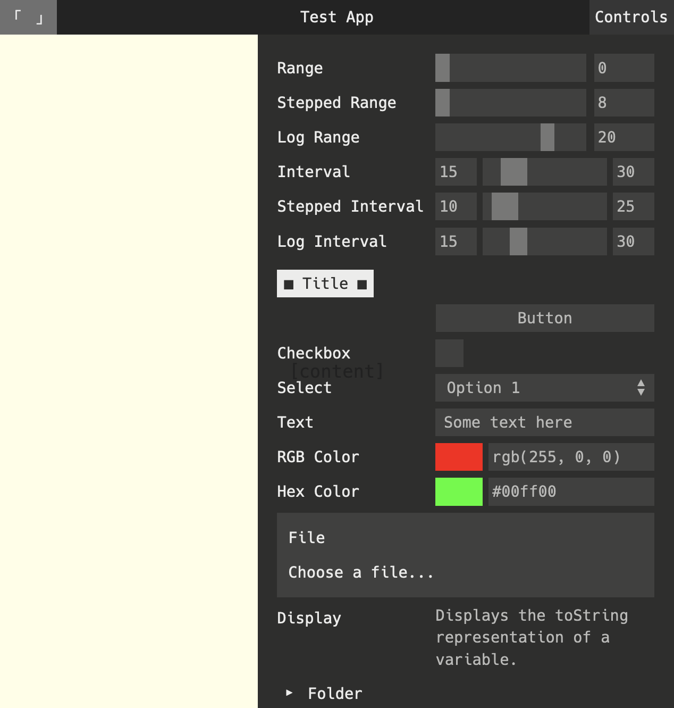

# guify

<p align="center">
    
</p>
<p align="center">
    <a href="https://badge.fury.io/js/guify"></a>
</p>

<p align="center">
    <a href="https://jons.website/projects/guify">Demo</a>
    |
    <a href="/docs/api.md">Docs</a>
</p>

Guify is a runtime JS library that gives you a simple way to build a GUI for your JS projects. It pairs very well with [three.js](https://threejs.org/) and [p5.js](https://p5js.org/). Consider it an opinionated take on [dat.GUI](https://github.com/dataarts/dat.gui).

Here are the big features:

* Bind any UI component to any variable. Guify supports arbitrary text inputs, colors, ranges, file inputs, booleans, and more.
* Guify is easy to graft onto any page and integrate with your existing JS code. Just point your components at the variables you already have:
    ```js
    var someVariable = 0;
    guify.Register([{
        {
            type: 'range',
            object: this, property: 'someProperty',
            label: 'Some Property',
            min: 0, max: 20, step: 1
        },
    }])
    ```
* Give it that "web app" look with an optional header bar and easy toast notifications.
* Style it however you'd like. You can use one of three built-in themes, or build your own to get exactly the look you want.

---

## Installation

Below are some common ways to integrate Guify with your setup.

### Quick Start (Browser)

To integrate on an existing page, you can use the transpiled version in [`/lib`](/lib), either by including it with your files or using a CDN:

```html
<script src="https://unpkg.com/guify@0.15.1/lib/guify.min.js"></script>
```

This adds a `guify` function at the global level, which you can use to construct the GUI. For example:

```html
<script src="https://unpkg.com/guify@0.15.1/lib/guify.min.js"></script>

<script>
    var gui = new guify({ ... })
    gui.register([ ... ])
</script>
```

See the <a href="#Usage">Usage guide</a> below for more details. [example.html](/example/index.html) also demonstrates this pattern.

### Quick Start (NPM)

First, install with NPM: `npm install --save guify`

Then you can import using either `require` or `import` depending on your preference:
```js
// ES6
import guify from 'guify'

// Require
let guify = require('guify');
```

Then you can make a quick GUI this way:
```js
var gui = new guify({ ... });
gui.Register([ ... ]);
```

See the <a href="#Usage">Usage guide</a> below for more details.

### Quick Start (React)

Check out the unofficial [React port](https://github.com/dbismut/react-guify).

---

## Usage

Once you have Guify available to construct in your project, make a `guify` instance:

```js
var gui = new guify({
    title: "Some Title",
});
```

The various controls in Guify are called "components". You can feed component definitions to Guify as follows:

```js
gui.Register([
    { // A slider representing a value between 0 and 20
        type: 'range', label: 'Range',
        min: 0, max: 20, step: 1,
        onChange: (value) => {
            console.log(value);
        }
    },
    {
        type: 'button', label: 'Button',
        action: () => {
            console.log('Button clicked!');
        }
    },
    {
        type: 'checkbox', label: 'Checkbox',
        onChange: (value) => {
            console.log(value);
        }
    }
]);
```

You can also bind components representing a value to your JS variables instead of using an `onChange()` handler. For example:

```js
var someNumber = 10;
gui.Register([
    { // A slider representing `someNumber`, constrained between 0 and 20.
        type: 'range', label: 'Range',
        min: 0, max: 20, step: 1,
        object: this, property: 'someNumber'
    },
```

There are many points of customization here. See the docs at [/docs/api.md](/docs/api.md). A much more robust example can also be found at [example.html](/example/index.html).


### Building This Package
If you want to build this package, you can run `npm install` and then `npm run build:prod`, which will create `/lib/guify.min.js`.

NPM commands:

- `build:prod`: Creates `/lib/guify.min.js`, the default script used by this package.
- `build:dev`: Creates `/lib/guify.js`.
- `develop`: Runs `build:dev` and serves the `/example` directory as a static web page.

---

## Changelog
See [changelog.md](/changelog.md).


## License
MIT license. See [license.md](/license.md) for specifics.


## Credit
This package is largely based on [control-panel](https://github.com/freeman-lab/control-panel).
For setting this up, I used [webpack-library-starter](https://github.com/krasimir/webpack-library-starter).

## Alternatives
- [dat.GUI](https://github.com/dataarts/dat.gui)
- [Control-Panel](https://github.com/freeman-lab/control-panel)
- [Oui](https://github.com/wearekuva/oui)
